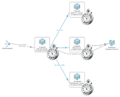

## Tier Time Monitor Plugin

 
 
The Tier Performance Metrics Monitor plugin queries a built-in Transaction Flow Dashboard to return response time, execution time, execution CPU time, transaction count, and transaction count rate.  
Metrics can be split by agent name, agent group, or technology.  
Metrics can also be filtered by agent group, agent name, and business transaction.  
The plugin supports both HTTP and HTTPS. 
 
 
<b>Plugin Parameters:</b> 
	Protocol (required) - http protocol to access the dynaTrace server rest interface 
	Port  (required) - http port to access the dynaTrace server rest interface 
	username (required) - username to log into the dynaTrace server 
	password (required) - password to log into the dynaTrace server 
	Aggregation (required) - min/avg/max aggregation of measures 
	Split by (required) - split tier time by agent name, agent group, or technology 
	System Profile Filter (required) - System Profile Name 
	Timeframe Filter (required) - Timeframe for tier times 
	Additional Filters? (optional) - yes/no 
	Filter by Agent Group / Pattern (optional) - yes/no 
	Agent Filter Type (optional) - Filter by agent group or agent pattern 
	Agent Group Filter (optional) - Agent group name 
	Agent Pattern Match Type (optional) - agent pattern filter (starts, ends, or match) 
	Agent Pattern Filter (optional) - Pattern on which to filter the agents 
	Filter by Business Transaction (optional) - yes/no 
	Business Transaction Filter (optional) - Business Transaction name 
 
 
<b>Measures:</b> 
	Response Time 
	Execution Time 
	Execution CPU Time 
	Transaction Count 
	Transaction Count Rate 
	Optional Measure Parameters: 
		Tier Filter (required) - Tier name (none = all tiers) 
 
Find further information in the [Dynatrace community](https://community.dynatrace.com/community/display/DL/Tier+Time+Monitor+Fastpack)